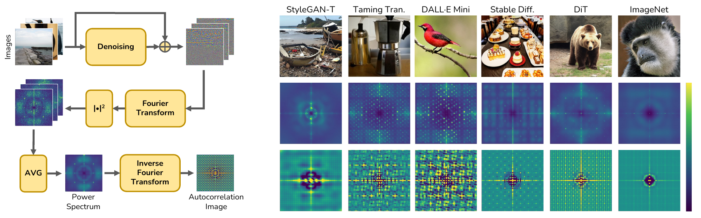

# Intriguing properties of synthetic images: from generative adversarial networks to diffusion models

[](https://grip-unina.github.io/SyntheticImagesAnalysis/)
[](https://doi.org/10.48550/arXiv.2304.06408)
[](https://openaccess.thecvf.com/content/CVPR2023W/WMF/html/Corvi_Intriguing_Properties_of_Synthetic_Images_From_Generative_Adversarial_Networks_to_CVPRW_2023_paper.html)
[](https://www.grip.unina.it)

<p align="center">
 
</p>


## Code
Official implementation of the paper: "Intriguing properties of synthetic images: from generative adversarial networks to diffusion models". 

We provide a script to generate the images showing the power spectra and the autocorrelation of the fingerprint.
In order to launch the code, please download the denoiser's weight from the following [link](https://drive.google.com/file/d/1MvnHmtinwL1kNAUl1ikHsPKz5XIfCpFx/view?usp=sharing). Once extracted there should be a folder called DenoiserWeight. Please do not move or rename this folder.

To launch the script the following parameters should be provided.

```
python generate_images.py --files_path /path/to/the/folder/with/the/synthetic/images --out_dir /path/to/folder/to/save/generated/images --out_name name_of_subfolder
```

The following command is an example of how to launch the script on images of the test set of the repository present at this [link](https://github.com/grip-unina/DMimageDetection).

```
python generate_images.py --files_path ./TestSet/stable_diffusion_256 --out_dir ./output --out_name stable_diffusion
```

In this case, after launching the script a folder called output will be created. In it, there will be a folder named stable_diffusion containing two images, one of the power spectra and one of the autocorrelation.


We provide also a script to generate images showing the radial spectra and the angular spectra of the desired images.

To script should be launched as follows.

```
python generate_spectra.py --files_path /path/to/the/folder/with/the/synthetic/images --out_dir /path/to/folder/to/save/generated/images --out_name name_of_subfolder
```

The following is an example on how to run this script on images of the dataset used previously.

```
python generate_spectra.py --files_path ./TestSet/stable_diffusion_256 --out_dir ./output --out_name stable_diffusion
```

In this case, after launching the script a folder called output will be created, if necessary. In it, there will be a folder named stable_diffusion containing two images, one of the radial spectra and one of the angular spectra.


## Requirements


## Overview

Detecting fake images is becoming a major goal of computer vision. This need is becoming more and more pressing with the continuous improvement of synthesis methods based on Generative Adversarial Networks (GAN), and even more with the appearance of powerful methods based on Diffusion Models (DM). Towards this end, it is important to gain insight into which image features better discriminate fake images from real ones. In this paper we report on our systematic study of a large number of image generators of different families, aimed at discovering the most forensically relevant characteristics of real and generated images. Our experiments provide a number of interesting observations and shed light on some intriguing properties of synthetic images: (1) not only GANs architectures give rise to artifacts visible in the Fourier domain, but also DMs and VQ-GANs (Vector Quantized Generative Adversarial Networks) present irregular patterns; (2) when the dataset used to train the model lacks sufficient variety, its biases can be transferred to the generated images; (3) synthetic and real images differ statistically in the mid-high frequency signal content, observable in their radial and angular spectral energy distribution.

## License

The license of the code can be found in the LICENSE.md file.

## Bibtex 

```
@InProceedings{Corvi_2023_CVPR,
    author    = {Corvi, Riccardo and Cozzolino, Davide and Poggi, Giovanni and Nagano, Koki and Verdoliva, Luisa},
    title     = {Intriguing Properties of Synthetic Images: From Generative Adversarial Networks to Diffusion Models},
    booktitle = {Proceedings of the IEEE/CVF Conference on Computer Vision and Pattern Recognition (CVPR) Workshops},
    month     = {June},
    year      = {2023},
    pages     = {973-982}
}
```
