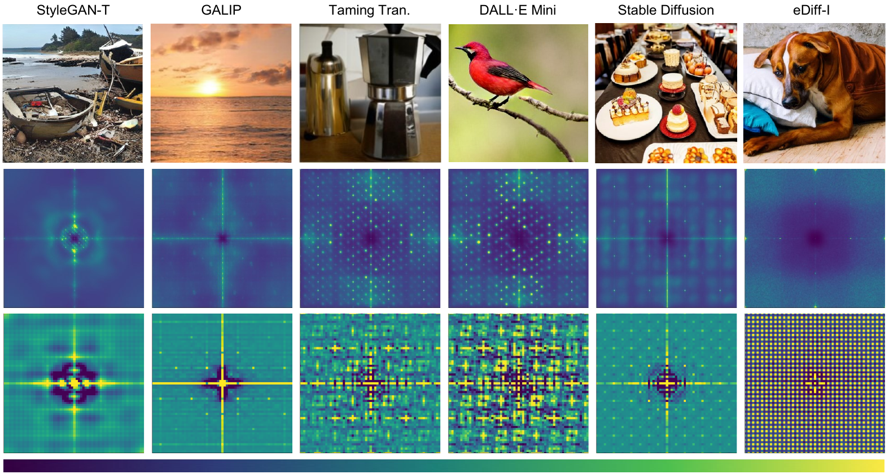

[](https://github.com/grip-unina/SyntheticImagesAnalysis/)
[](https://doi.org/10.48550/arXiv.2304.06408)
[](https://openaccess.thecvf.com/content/CVPR2023W/WMF/html/Corvi_Intriguing_Properties_of_Synthetic_Images_From_Generative_Adversarial_Networks_to_CVPRW_2023_paper.html)
[](https://www.grip.unina.it)

<center></center>

Detecting fake images is becoming a major goal of computer vision. This need is becoming more and more pressing with the continuous improvement of synthesis methods based on Generative Adversarial Networks (GAN), and even more with the appearance of powerful methods based on Diffusion Models (DM). Towards this end, it is important to gain insight into which image features better discriminate fake images from real ones. In this paper we report on our systematic study of a large number of image generators of different families, aimed at discovering the most forensically relevant characteristics of real and generated images. Our experiments provide a number of interesting observations and shed light on some intriguing properties of synthetic images: (1) not only GANs architectures give rise to artifacts visible in the Fourier domain, but also DMs and VQ-GANs (Vector Quantized Generative Adversarial Networks) present irregular patterns; (2) when the dataset used to train the model lacks sufficient variety, its biases can be transferred to the generated images; (3) synthetic and real images differ statistically in the mid-high frequency signal content, observable in their radial and angular spectral energy distribution.


## Bibtex

```
@InProceedings{Corvi_2023_CVPR,
    author    = {Corvi, Riccardo and Cozzolino, Davide and Poggi, Giovanni and Nagano, Koki and Verdoliva, Luisa},
    title     = {Intriguing Properties of Synthetic Images: From Generative Adversarial Networks to Diffusion Models},
    booktitle = {Proceedings of the IEEE/CVF Conference on Computer Vision and Pattern Recognition (CVPR) Workshops},
    month     = {June},
    year      = {2023},
    pages     = {973-982}
}
```
